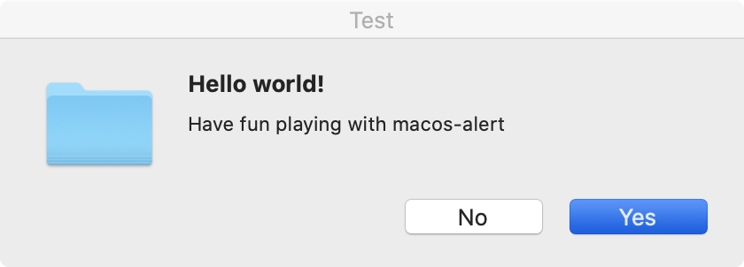

# macos-alert

[English](README.md) [中文](README_CN.md)

A tool to show a alert windows in shell scripts on MacOS.



# Usage

```shell
./macos-alert <<EOF
title = Test
message = Hello world!
subMessage = Have fun playing with macos-alert
icon = icon.png
buttons = Yes, No
needRet = true
EOF
```

For more details, run `./macos-alert --help`

# Build

```shell
mkdir build
cd build
cmake -DCMAKE_BUILD_TYPE=Release ..
make
```

# Binary

Click [bin/macos-alert](bin/macos-alert) to download
